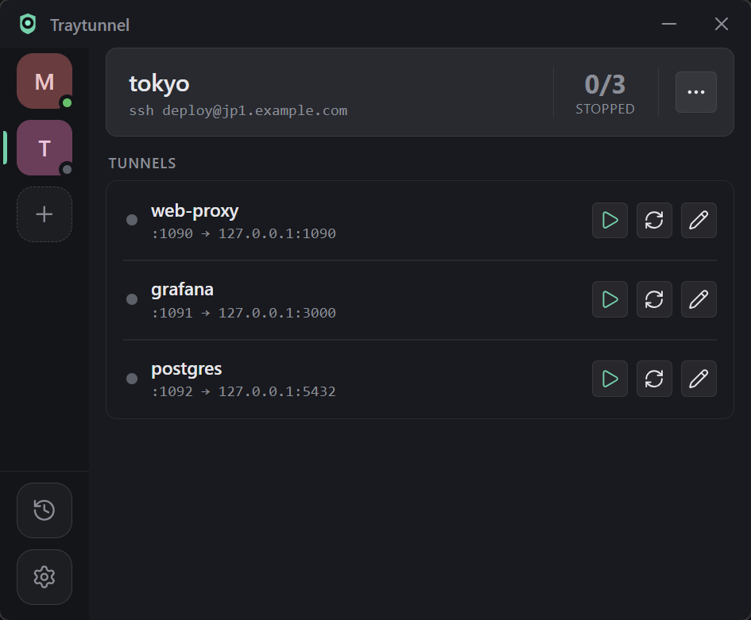

<p align="center"></p>

<h1 align="center">traytunnel</h1>

<p align="center">Windows 系統匣 SSH 隧道管理工具</p>
<p align="center"><i>Windows tray SSH tunnel manager built with Tauri</i></p>

<p align="center">
  <a href="https://github.com/hunandy14/traytunnel/releases"></a>
  <a href="LICENSE"></a>
</p>

Windows 系統匣（tray）SSH 隧道管理工具，以 [Tauri v2](https://tauri.app/) 撰寫，前端是 vanilla TypeScript + Vite，隧道管理、設定檔讀寫與連通檢測全部在 Rust 側完成。

程式讀取一份 TOML 設定檔（預設是 `%USERPROFILE%\.traytunnel.toml`），支援**多組連線（connection）**（各自的 host／user／ProxyCommand），**每條隧道（tunnel）各自維持一條獨立的 SSH 連線**並在斷線時各自重連，同時對每條隧道做連通自我檢測，狀態即時顯示在系統匣圖示與主視窗中。

## 截圖

<p align="center">
  
</p>

<!-- 待補：托盤選單截圖
<p align="center">
  
</p>
-->


## 功能

- 系統匣常駐，可設定開機自動啟動（啟動時帶 `--tray` 直接隱藏到系統匣）
- 多組連線：每個 `[[sources]]` 是一組獨立的 ssh 連線參數，底下各自掛自己的隧道，可整組 Connect／Disconnect／Reconnect
- 每個 `[[sources.forwards]]` 隧道一條獨立的 `ssh.exe -N -L`，可個別 Connect／Disconnect／Reconnect，一條隧道斷線或重連不會影響其他隧道
- 隧道的 Connect／Disconnect 選擇會寫回設定檔的 `enabled`，下次啟動只自動連線 `enabled` 的隧道（所有連線一起）
- 斷線後固定 5 秒重連，無退避、無次數上限，每條隧道自己數自己的
- 本地埠衝突三層防護：設定階段擋重複埠（跨連線也擋，訊息會點名佔用者與它所屬的連線）、spawn 前偵測埠是否已被其他程序佔用（狀態顯示 `port_busy`，每 5 秒重查而不盲目 spawn），最後由 ssh 的 `ExitOnForwardFailure=yes` 兜底
- 各隧道經本地 SOCKS5 埠檢測連通性，顯示對外 IP 與所在地（此功能會經隧道向第三方服務 ipinfo.io 發出請求）
- 支援透過 `ProxyCommand`（例如 `cloudflared access ssh`）連線
- 單一實例：重複啟動只會把既有的主視窗叫出來
- 系統匣提示跨連線彙總所有隧道狀態，例如 `Traytunnel - 3/4 connected`；右鍵選單是狀態行、隧道勾選、`Connect all`／`Disconnect all`／`Reconnect all`，多組連線時每組收成一個子選單（底下有 `Reconnect`）
- 系統匣圖示依 `SM_CXSMICON` 從多層 ICO 挑原生尺寸的那一層（含 16／20／24／28／32px），高 DPI 下不會被 GDI 拉伸糊掉
- 通知掛在自己的 AppUserModelID 底下：啟動時自註冊開始選單捷徑與 `HKCU\Software\Classes\AppUserModelId`，toast 顯示的是 Traytunnel 而不是 Windows PowerShell
- 每條 ssh 子程序各自放在一個 Windows Job Object 內，隧道停掉或程式結束時整棵程序樹（含 `cloudflared`）一起收掉

## 下載

到 [Releases](https://github.com/hunandy14/traytunnel/releases) 頁面抓最新版，依需求挑一種：

| 檔名 | 說明 |
| --- | --- |
| `traytunnel-<版本>.exe` | 一般單檔，免安裝，設定檔在家目錄（`%USERPROFILE%\.traytunnel.toml`） |
| `traytunnel-<版本>p.exe` | 可攜版，與上面**同一顆二進位**，檔名以 `p` 結尾＝設定檔跟著 exe 走 |
| `traytunnel-<版本>-setup.exe` | NSIS 安裝檔 |

每個 Release 也會附上 `SHA256SUMS.txt`，可用它核對下載檔案的完整性（例如 `Get-FileHash -Algorithm SHA256 <檔案>` 比對雜湊值是否一致）。

## 介面

介面上的用詞與設定檔的結構對應：一個 `[[sources]]` 在畫面上叫一條**連線**（connection），底下的每個 `[[sources.forwards]]` 叫一條**隧道**（tunnel）。

視窗分成左側的連線軌道與右側的主區，兩者都可隨視窗縮放（最小 480×420）：

- **左側連線軌道**：每條連線一個圓角方塊，圖案是連線名首字，底色由名稱 hash 決定，右下角的小點是該連線的彙總狀態（全連綠／部分琥珀／全停灰／有隧道出錯紅）。清單底部的虛線「＋」新增連線；左下角固定放活動日誌與設定兩個鈕。
- **主區（選中的連線）**：頂部彙總卡分三段——左邊是連線名稱與 `ssh user@host`，中間用豎分隔線隔出大分數 `n/m` 與 `CONNECTED` 小字（顏色跟著整條連線的健康度走），右邊只有一顆「⋯」。⋯ 點開的選單收了 Add tunnel、Disconnect／Connect（整條連線一起）、Reconnect、Activity，分隔線下再放 Edit connection。
- **隧道清單**：彙總卡下方是標題 `TUNNELS` 的隧道清單，整份包在單一外框裡，列與列之間用內縮的細分隔線分開，滑過去整列微亮。每列左側是狀態點、名稱與 `:local → remote`，右側兩行是最近一次自測結果（上行地點、下行對外 IP），最右邊是連接／中斷、重新連接、編輯三個鈕。外框高度跟著列數長，長到超過主區可用高度時就固定在那裡、改由框內捲動，外框與圓角一直留在畫面上。
- **活動日誌頁**：左下的時鐘鈕（或 ⋯ 選單的 Activity）把主區換成所有連線的完整日誌，點任一連線 icon 即返回。
- **設定頁**：左下的齒輪把主區換成設定頁，目前有「關閉時縮到系統匣」與「開機自動啟動」兩個即時生效的開關；下方的 About 分節顯示版本號，以及「Config file」一列（副標是實際生效的設定檔完整路徑，點整列會開檔案總管並選中它）。
- **連線編輯**：⋯ 選單的 Edit connection 或側欄的「＋」會開出置中的編輯 sheet（name／host／user／ProxyCommand），驗證錯誤逐欄顯示；刪除連線需要一次確認。頁腳左側的 Test 鈕可以在存檔前就拿表單當下填的值試連一次（spawn 一次性 `ssh ... exit`，不建立任何轉發），結果就地顯示成功的綠字「Connected」或失敗的紅字（帶 ssh 的錯誤原因，例如 DNS 解析失敗、逾時、金鑰被拒），逾時 15 秒兜底；host／user 空白時按 Test 直接顯示欄位驗證錯誤，不會真的去連。
- **隧道編輯**：列上的鉛筆、⋯ 選單的 Add tunnel、以及零隧道時的虛線引導卡，都開同一個 sheet（name／local port／remote）。remote 欄的提示是 `1080 (server-side port) or host:port`——只填埠號就是伺服器本機的那個埠，補成 `host:port` 由後端做。刪除隧道不跳確認，先從畫面移除、5 秒內可以按 Undo 收回。

## 需求

執行：

- Windows 10/11，內建 WebView2 Runtime（Windows 11 已預裝）
- `ssh.exe`（OpenSSH 用戶端）
- 選配：`cloudflared`，若你的 SSH 主機需要透過 Cloudflare Access 存取

開發與建置另外需要：

- [Rust 工具鏈](https://www.rust-lang.org/tools/install)（含 MSVC Build Tools）
- [Node.js](https://nodejs.org/) 18 以上

## 開發

```
npm install
npm run tauri dev
```

### 瀏覽器 UI 開發模式

只想調畫面、不想每次都等 Rust 編譯時，可以只開前端：

```
npm run dev
```

然後用瀏覽器打開 http://localhost:1420/ 。整個 UI 只有這一頁，主區靠左側欄切換。

這個模式下沒有 Tauri runtime，前端會自動掛上一層假後端：

- 用官方的 `@tauri-apps/api/mocks` 的 `mockIPC`（開啟 `shouldMockEvents`）攔截所有 `invoke`，並讓 `listen`／`emit` 走記憶體，所以前端程式碼完全不用為了 mock 改寫
- 偵測方式是 Tauri v2 官方提供的 `isTauri()`，偵測不到才啟用
- 假資料有三條連線（`tokyo` 兩條隧道、`taipei` 兩條隧道、`lab` 零隧道示範空狀態），涵蓋每條隧道獨立的 `connecting → connected`、自測 `testing → ok`／`fail`、固定會撞埠的 `port_busy`，以及跨連線的本地埠衝突；隧道的連接／中斷／重新連接、整條連線的啟停與重接、隧道的新增／編輯／刪除（含 undo）、連線的新增／編輯／刪除都能實際操作
- 設定存檔只寫進 `sessionStorage`，不會碰到真的設定檔
- 另外掛了 `window.__mock` 供演練特定狀態：`__mock.drop(1080)` 模擬斷線重連、`__mock.status(1080, "error", "…")` 直接指定狀態、`__mock.wipe()` 清掉所有連線看零連線空狀態、`__mock.configDelay(1500)` 讓 `config-changed` 晚於 invoke 的 resolve 送達（真後端就是這個順序，用來驗證改名後的選中不會被回退吃掉）、`__mock.reset()` 清掉暫存重來

假後端只在 `npm run dev` 且偵測不到 Tauri 時才會動態載入。正式建置時 `import.meta.env.DEV` 是常數 `false`，整段連同 `src/dev-mock.ts` 都會被搖掉，不會進打包產物。

## 建置

三個指令，差別只在要不要順便打包安裝檔：

| 指令 | 做什麼 |
| --- | --- |
| `npm run build:exe` | 只編免安裝執行檔，跳過打包（`tauri build --no-bundle`），平常改完程式驗一下最快 |
| `npm run build:setup` | 執行檔＋NSIS 安裝檔（`tauri build --bundles nsis`） |
| `npm run build:all` | 走設定檔裡列的全部 bundle 目標（`tauri build`），要發佈時用 |

三個指令都會在建置後跑 `node scripts/package.mjs`，把產物複製成發佈用的檔名放進根目錄的 `out/`（每次重跑會先清空）：

| 發佈檔 | 說明 |
| --- | --- |
| `out/traytunnel-<版本>.exe` | 一般單檔，設定檔走 `%USERPROFILE%\.traytunnel.toml` |
| `out/traytunnel-<版本>p.exe` | 可攜版。**與上面同一顆二進位**，差別只在檔名結尾的 `p`——那個 p 就是可攜模式的記號，設定檔改放 exe 旁邊 |
| `out/traytunnel-<版本>-setup.exe` | NSIS 安裝檔 |

版本號取自 `src-tauri/Cargo.toml` 的 `[package]` `version`（單一來源）。來源檔還沒建出來的那一項會跳過並印一行提示，所以 `build:exe` 不產安裝檔也能照跑。原始產物仍留在 `src-tauri/target/release/` 底下，`out/` 只是複製出來的發佈命名版本，已列入 `.gitignore`。

注意：一定要走上面這幾個指令（底層都是 `tauri build`）。直接下 `cargo build --release` 產出的執行檔會去連 Vite 開發伺服器（`devUrl`），而不是內嵌的前端檔案，開起來會是一片空白。`cargo build` 只適合拿來檢查 Rust 端能不能編譯。

免安裝使用時把 `traytunnel.exe` 放哪裡都行，設定檔預設落在 `%USERPROFILE%\.traytunnel.toml`；想連設定一起帶著走，把執行檔改名成 `p` 結尾（例如 `traytunnel-0.2.0p.exe`）或在旁邊放一個 `traytunnel.toml` 即可（見下方「設定檔」）。

### 版本管理

單一權威是 `src-tauri/Cargo.toml` 的 `[package]` `version`；`package.json` 是惰性副本。`src-tauri/tauri.conf.json` 沒有 `version` 欄位——這是刻意的：Tauri v2 官方規定省略該欄位時會 fallback 讀 `src-tauri/Cargo.toml` 的 `package.version`，`getVersion()`、NSIS 安裝檔名、`tauri-action` 全部自動跟著這顆版號走，不用再另外同步一份。升版一律用：

```
npm run bump <x.y.z>
```

會驗參數是嚴格 semver、確認兩處現值一致後才動手改，改完不會自動 commit、不會自動 tag，只印一行建議指令供複製。下次建置時 `Cargo.lock` 裡的版號會跟著更新，記得跟兩個檔案一併提交。

### Release 流程

發版走兩個 workflow 接力：`.github/workflows/autotag.yml` 負責貼 tag，`.github/workflows/release.yml` 在 `windows-latest` runner 上跑 `npm run build:all` 並把 `out/*.exe` 上傳成 GitHub Release。主流程只需要：

```
npm run bump <x.y.z>
git add src-tauri/Cargo.toml src-tauri/Cargo.lock package.json
git commit -m "版本升級至 <x.y.z>"
git push
```

開 PR、合併進 `main` 後，`autotag.yml` 偵測到 `src-tauri/Cargo.toml` 的版號變動，會自動建立 annotated tag `v<x.y.z>` 並推送，接著主動 dispatch `release.yml` 觸發建置發佈（GitHub 的防遞迴機制不會讓 `GITHUB_TOKEN` push 的 tag 自己觸發其他 workflow，所以由 `autotag.yml` 補這一腳）；`release.yml` 收到後照原本邏輯確認同名 tag 已存在再建置。

以下是備援手段，主流程正常運作時不需要用到：

<details>
<summary>備援：手動貼 tag</summary>

`autotag.yml` 若因故沒有跑（例如版號變動沒有進到 `main`、workflow 被停用），可以自己補 tag 觸發：

```
git tag -a v<x.y.z> -m "v<x.y.z>"
git push --tags
```

push tag（`v*`）會自動觸發 `release.yml`，比對 tag 版號與 `src-tauri/Cargo.toml` 的 `version` 一致後才建置發佈，不一致直接 fail。

</details>

<details>
<summary>備援：Actions 頁手動補發</summary>

發佈失敗要重跑時，改走 Actions 頁面的 *Run workflow*（`release.yml` 的 `workflow_dispatch`）：不用帶參數，直接以目前 `src-tauri/Cargo.toml` 的版號去掛對應的既有 tag（例如版號是 `0.4.1` 就掛 `v0.4.1`）；tag 還沒建立會直接 fail 並在 log 裡註明要先 tag、push --tags。

</details>

## 設定檔

設定檔的位置在啟動時解析一次，優先序如下：

| 順序 | 位置 | 何時生效 |
| --- | --- | --- |
| 1 | `<執行檔同目錄>\traytunnel.toml` | **可攜模式**。兩個觸發條件任一成立即可（見下方摺疊區塊），整支程式的讀寫都留在執行檔旁邊 |
| 2 | `%USERPROFILE%\.traytunnel.toml` | 預設位置。沒進可攜模式時一律用它 |

可攜模式概述：執行檔主檔名以 `p` 結尾，或執行檔旁放一個 `traytunnel.toml`，任一成立即進可攜模式，設定檔就在執行檔旁邊。完整判定規則、誤判排除見下方摺疊區塊。

第一次啟動若檔案不存在會自動在生效位置產生一份預設值，也可以直接複製範本：

```
copy traytunnel.toml.example %USERPROFILE%\.traytunnel.toml
```

實際生效的完整路徑一律以程式為準：設定頁的 About 分節有「Config file」一列，副標就是那個路徑，點整列會開檔案總管並選中該檔；啟動時的活動日誌也會記一行 `config: <路徑>`。

<details>
<summary>可攜模式完整判定規則</summary>

兩種觸發方式，任一成立就進可攜模式，設定檔都是執行檔旁邊的 `traytunnel.toml`：

- **執行檔名以 `p` 結尾**（Rufus 那套命名記號，本尊就是 `rufus-4.5p.exe`）：產品名 `traytunnel` 不是 p 結尾，所以主檔名（副檔名以外的部分）的最後一個字元是 p 就是刻意加上去的可攜記號。大小寫不敏感，例如 `traytunnel-0.2.0p.exe`、`traytunnel-p.exe`。這種情況下設定檔還不存在時會**自動在執行檔旁邊建一份預設值**，就像 Rufus 建自己的 ini。
  只認結尾是為了避開誤判：`traytunnel - Copy.exe`（Windows 複製檔案自動取的名字，Copy 裡有 p）、`traytunnel-preview.exe` 這種都**不算**可攜。
- **執行檔旁放一個 `traytunnel.toml`**（KeePass／Rufus 那套同名檔偵測）：檔案存在就改用它，空檔也算（程式會補齊內容）；把它刪掉或改名就回到家目錄那份。

放在隨身碟上、或想讓同一台機器的多份執行檔各自帶設定時用得到。要注意檔名記號一旦成立就沒得退回：`traytunnel-p.exe` 不會再去讀家目錄那份設定。

</details>

<details>
<summary>術語對照與欄位詳表</summary>

**術語對照**：介面上稱 **Connection**（一組 SSH 連線）與 **Tunnel**（一條轉發），設定檔的鍵名維持原樣不動——`[[sources]]` 就是 Connection、`[[sources.forwards]]` 就是 Tunnel。手改檔案的人不必跟著改名，舊檔案也照吃。

頂層欄位：

| 欄位 | 說明 |
| --- | --- |
| `closeToTray` | 關閉鈕（X）是否只隱藏到系統匣 |
| `[[sources]]` | 一組連線（介面稱 Connection），含 `name`、`host`、`user`、`proxyCommand` 與底下的 `[[sources.forwards]]` |

`[[sources]]` 的欄位：

| 欄位 | 說明 |
| --- | --- |
| `name` | 連線名稱，不可空白也不可含空格，且不可與其他連線重複 |
| `host` | SSH 主機 |
| `user` | SSH 使用者 |
| `proxyCommand` | ssh 的 `ProxyCommand`，不需要時留空字串 |

`[[sources.forwards]]` 的欄位（介面稱 Tunnel）：

| 欄位 | 說明 |
| --- | --- |
| `name` | 隧道名稱，不可空白也不可含空格 |
| `local` | 本地埠，同時是這條隧道的**全域**唯一鍵，跨連線也不可重複（含停用中的） |
| `remote` | 轉發目的地，格式 `host:port`。**只填埠號**（1-65535）代表伺服器本機的那個埠：介面上可以這樣填，直接手寫在檔案裡也算數，兩條路都會補成完整的 `127.0.0.1:<port>`，下次存檔後檔案裡就是完整形式 |
| `enabled` | 是否要保持連線；省略時視為 `true` |

每條隧道各自跑一條 `ssh`，連線參數（`host`／`user`／`proxyCommand`）取自它所屬的那組連線，並以自己的 `local` 埠是否進入 Listen 狀態判斷這條隧道是否連上。在介面上按 Connect／Disconnect 會即時寫回對應的 `enabled`。

也可以在程式裡編輯，存檔會寫回同一個檔案並保留你手寫的註解（包含寫在單一 `[[sources]]` 或單筆 `[[sources.forwards]]` 上方的註解）。

</details>

<details>
<summary>`.broken` 與遷移相關</summary>

- **舊制設定檔自動遷移**：偵測到頂層還有 `host` 欄位（只有單一連線的舊格式）時，會把它整包成一個 `[[sources]]`（連線名稱預設用 `host` 的值，其中的空白與中括號會被剝掉，例如 `[::1]` 會變成名稱 `::1`）、把原本的 `[[forwards]]` 搬成 `[[sources.forwards]]`，並就地寫回新格式；檔頭與逐筆隧道上方的註解都會保留
- **不會自動搬家**：舊版把設定檔固定放在執行檔同目錄，升級後那份檔案會直接被當成可攜模式繼續使用；想改用家目錄的預設位置，請自行把 `traytunnel.toml` 移到 `%USERPROFILE%\.traytunnel.toml`（執行檔旁邊那份要刪掉或改名，否則它優先）
- 升級注意：舊設定檔如果含有**重複的 `local` 埠**（舊版沒擋下來的話），升級時會被判為無法解析，另存一份 `.broken` 並改用預設值啟動，請手動把重複的埠改掉再放回去
- 設定檔解析失敗時**不會被覆寫**，程式會在同一個資料夾另存一份「生效檔名 + `.broken`」（家目錄模式是 `.traytunnel.toml.broken`，可攜模式是 `traytunnel.toml.broken`）並改用預設值繼續執行；內容自相矛盾（連線名稱重複、跨連線撞埠、`host`／`user` 空白）也算解析失敗
- 用 PowerShell 之類的工具存檔若帶了 UTF-8 BOM，也能正常解析

</details>

設定檔為個人本機設定，`traytunnel.toml` 已加入 `.gitignore`，不會被提交。

## 授權

MIT License，詳見 [LICENSE](LICENSE)。
